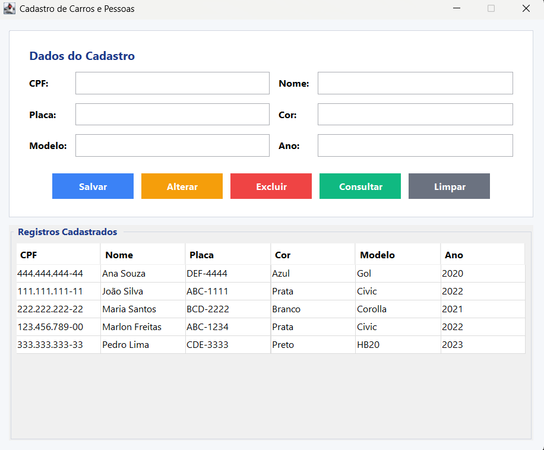

<div align="center">

# 🚗 Sistema de Cadastro de Carros e Pessoas


Interface gráfica desktop desenvolvida em **Java Swing** para cadastro de pessoas e veículos, com persistência em banco de dados **MySQL** via **JDBC**.

</div>

---

## 📸 Interface

<div align="center">
  
</div>

---

## ✅ Funcionalidades

- ➕ **Cadastrar** pessoa e carro vinculados
- ✏️ **Alterar** dados de um registro existente
- 🗑️ **Excluir** registro com confirmação
- 🔍 **Consultar** todos os registros do banco
- 📋 Tabela interativa — clique em uma linha para carregar os dados nos campos automaticamente

---

## 🗂️ Estrutura do projeto

```
aula006/
├── src/
│   ├── Pessoa.java         # Modelo da entidade Pessoa
│   ├── Carro.java          # Modelo da entidade Carro
│   ├── ConexaoBD.java      # Gerencia a conexão com o banco de dados
│   ├── PessoaDAO.java      # Operações de banco para Pessoa (CRUD)
│   ├── CarroDAO.java       # Operações de banco para Carro (CRUD)
│   └── TelaCadastro.java   # Interface gráfica principal (JFrame)
├── img/
│   └── interface.png       # Screenshot da interface
└── README.md
```

---

## 🛠️ Tecnologias utilizadas

| Tecnologia | Uso |
|---|---|
| Java SE | Linguagem principal |
| Java Swing | Interface gráfica (JFrame, JTable, JButton...) |
| JDBC | Conexão com o banco de dados |
| MySQL | Banco de dados relacional |
| Spring Tools for Eclipse | IDE de desenvolvimento |

---

## ⚙️ Pré-requisitos

- [Java JDK 8+](https://www.oracle.com/java/technologies/downloads/)
- [MySQL 5.7+](https://dev.mysql.com/downloads/mysql/)
- [mysql-connector-java-5.1.47.jar](https://dev.mysql.com/downloads/connector/j/)
- Eclipse ou Spring Tools for Eclipse

---

## 🗄️ Configuração do banco de dados

Execute o script abaixo no **MySQL Workbench** ou terminal:

```sql
CREATE DATABASE cadastro_carros
  CHARACTER SET utf8mb4
  COLLATE utf8mb4_unicode_ci;

USE cadastro_carros;

CREATE TABLE pessoa (
  cpf   VARCHAR(14)  NOT NULL,
  nome  VARCHAR(100) NOT NULL,
  PRIMARY KEY (cpf)
);

CREATE TABLE carro (
  placa      VARCHAR(10)  NOT NULL,
  cor        VARCHAR(50),
  modelo     VARCHAR(100),
  ano        INT,
  cpf_pessoa VARCHAR(14),
  PRIMARY KEY (placa),
  CONSTRAINT fk_pessoa
    FOREIGN KEY (cpf_pessoa)
    REFERENCES pessoa(cpf)
    ON DELETE CASCADE
    ON UPDATE CASCADE
);
```

> 💡 A tabela `pessoa` deve ser criada **antes** da tabela `carro` por causa da chave estrangeira.

---

## 🚀 Como executar

**1. Clone o repositório**
```bash
git clone https://github.com/seu-usuario/seu-repositorio.git
```

**2. Importe no Eclipse como Java Project**
- File → Import → Existing Projects into Workspace

**3. Adicione o conector MySQL ao Build Path**
- Botão direito no projeto → **Build Path → Configure Build Path**
- Aba **Libraries** → **Add External JARs...**
- Selecione o `mysql-connector-java-5.1.47.jar`

**4. Configure suas credenciais em `ConexaoBD.java`**
```java
private static final String URL     = "jdbc:mysql://localhost:3306/cadastro_carros";
private static final String USUARIO = "seu_usuario";
private static final String SENHA   = "sua_senha";
```

**5. Execute a aplicação**
- Botão direito em `TelaCadastro.java` → **Run As → Java Application**

---

## 🔒 Segurança

> ⚠️ **Nunca suba suas credenciais reais para o repositório!**
>
> Antes de commitar, certifique-se de que `ConexaoBD.java` contém apenas valores genéricos como `"sua_senha"` e `"seu_usuario"`.

---

## 📄 Licença

Este projeto foi desenvolvido para fins acadêmicos.
